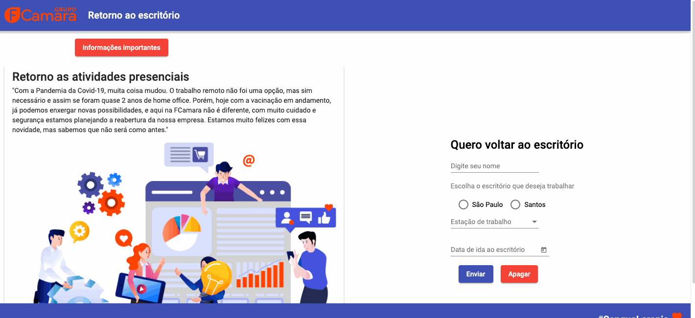

# Desafio-Imersao-FCamara

<h1>
  
</h1>

## 🔖 Sobre

O projeto foi desenvolvido através do desafio proposto pela empresa **FCamara** em parceria com a **Alura**, onde deveríamos criar uma landing page com agendamento para retorno das atividades presenciais.

---

## 🚀 Tecnologias utilizadas

O projeto foi desenvolvido utilizando as seguintes tecnologias:

### Front End
- [Angular 12](https://angular.io/)
- [Angular Material](https://material.angular.io/)
- [RxJS](https://rxjs.dev/)

### Back End
- [NodeJs](https://nodejs.org/en/)

### Banco de dados

- [MongoDB Community](https://www.mongodb.com/pt-br)

---

## 📂 Como baixar o projeto

```bash

  # Clonar o repositório
  $ git clone https://github.com/andreh-lacerda/desafio-imersao-fcamara.git

  # Entrar no diretório
  $ cd desafio-imersao-fcamara

  # Instalar as dependências
  $ npm i

  # Iniciar o projeto
  $ ng serve

  # Abra o navegador e digite http://localhost:4200

  # Para iniciar o servidor, abra outro terminal e após entrar no diretório desafio-imersao-fcamara, entre no diretório api
  $ cd api

  # Instalar as dependências
  $ npm i

  # Iniciar a api
  $ nodemon run start

  # A api está configurada para a porta http://localhost:9000
```
---
### Observações

- A integração e todas as funcionalidades entre o front end e back end ainda estão em fase inicial de desenvolvimento.
- Necessário ainda ajustar responsividade para todos tipos de tela.
